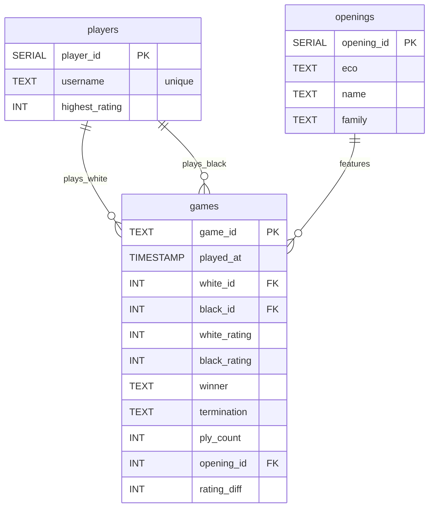

# Entity-Relationship Diagram

The diagram below visualises the three-table schema used throughout the project.

## How to read this ERD

- **players** has a one-to-many relationship to **games** twice: `plays_white` and `plays_black`, capturing each colour
- **openings** has a one-to-many relationship to **games** (`features`), indicating which ECO code was played
- Surrogate keys (`player_id`, `opening_id`) keep joins fast and compact
- `rating_diff` is a derived metric used for “upset” queries (not a foreign key)

These three tables contain every column referenced by the analytical queries in `README.md`.
